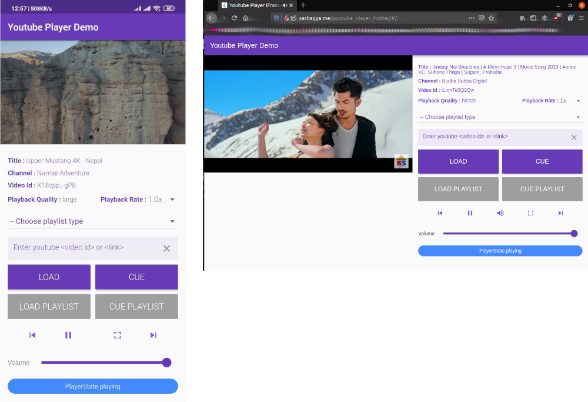

# Youtube Player IFrame

[](https://pub.dartlang.org/packages/youtube_player_iframe)
[](https://github.com/sarbagyastha/youtube_player_flutter/blob/master/LICENSE)
[](https://github.com/sarbagyastha/youtube_player_flutter/releases)
[](https://github.com/sarbagyastha/youtube_player_flutter)
[](https://github.com/sarbagyastha/youtube_player_flutter)
[](https://dart.dev/guides/language/effective-dart)
[](https://sarbagyastha.github.io/youtube_player_flutter)

Flutter plugin for playing or streaming YouTube videos inline using the official [**iFrame Player API**](https://developers.google.com/youtube/iframe_api_reference).
The package exposes almost all the API provided by **iFrame Player API**. So, it's 100% customizable.



[Click here for WEB DEMO](https://sarbagyastha.github.io/youtube_player_flutter)

## Salient Features
* Inline Playback
* Supports captions
* No need for API Key
* Supports custom controls
* Retrieves video meta data
* Supports Live Stream videos
* Supports changing playback rate
* Exposes builders for building custom controls
* Playlist Support (Both custom and Youtube's playlist)
* Supports Fullscreen Gestures(Swipe up/down to enter/exit fullscreen mode)

This package uses [webview_flutter](https://pub.dev/packages/webview_flutter) under-the-hood.

## Setup
See [**webview_flutter**'s doc](https://pub.dev/packages/webview_flutter) for the requirements.

### Using the player
Start by creating a controller.

```dart
final _controller = YoutubePlayerController(
  params: YoutubePlayerParams(
    mute: false,
    showControls: true,
    showFullscreenButton: true,
  ),
);

_controller.loadVideoById(...); // Auto Play
_controller.cueVideoById(...); // Manual Play
_controller.loadPlaylist(...); // Auto Play with playlist
_controller.cuePlaylist(...); // Manual Play with playlist

// If the requirement is just to play a single video.
final _controller = YoutubePlayerController.fromVideoId(
  videoId: '<video-id>',
  autoPlay: false,
  params: const YoutubePlayerParams(showFullscreenButton: true),
);
```

Then the player can be used in two ways:

#### Using `YoutubePlayer`
This widget can be used when fullscreen support is not required.

```dart
YoutubePlayer(
  controller: _controller,
  aspectRatio: 16 / 9,
);

```

#### Using `YoutubePlayerScaffold`
This widget can be used when fullscreen support for the player is required.

```dart
YoutubePlayerScaffold(
  controller: _controller,
  aspectRatio: 16 / 9,
  builder: (context, player) {
    return Column(
      children: [
        player,
        Text('Youtube Player'),
      ],
    ),
  },
),
```

See the [example app](example/lib/main.dart) for detailed usage.

## Inherit the controller to descendant widgets
The package provides `YoutubePlayerControllerProvider`.

```dart
YoutubePlayerControllerProvider(
  controller: _controller,
  child: Builder(
    builder: (context){
      // Access the controller as: 
      // `YoutubePlayerControllerProvider.of(context)` 
      // or `controller.ytController`.
    },
  ),
);
```

## Want to customize the player?
The package provides `YoutubeValueBuilder`, which can be used to create any custom controls.

For example, let's create a custom play pause button.
```dart
YoutubeValueBuilder(
   controller: _controller, // This can be omitted, if using `YoutubePlayerControllerProvider`
   builder: (context, value) {
      return IconButton(
         icon: Icon( 
           value.playerState == PlayerState.playing
             ? Icons.pause
             : Icons.play_arrow,
         ),
         onPressed: value.isReady
            ? () {
              value.playerState == PlayerState.playing
                ? context.ytController.pause()
                : context.ytController.play();
              }
            : null,
      );
   },
);
```

## Limitation 
For Android: Since the plugin is based on platform views. This plugin requires Android API level 19 or greater.

## License
```
Copyright 2022 Sarbagya Dhaubanjar. All rights reserved.

Redistribution and use in source and binary forms, with or without modification,
are permitted provided that the following conditions are met:

    * Redistributions of source code must retain the above copyright
      notice, this list of conditions and the following disclaimer.
    * Redistributions in binary form must reproduce the above
      copyright notice, this list of conditions and the following
      disclaimer in the documentation and/or other materials provided
      with the distribution.

THIS SOFTWARE IS PROVIDED BY THE COPYRIGHT HOLDERS AND CONTRIBUTORS "AS IS" AND
ANY EXPRESS OR IMPLIED WARRANTIES, INCLUDING, BUT NOT LIMITED TO, THE IMPLIED
WARRANTIES OF MERCHANTABILITY AND FITNESS FOR A PARTICULAR PURPOSE ARE
DISCLAIMED. IN NO EVENT SHALL THE COPYRIGHT OWNER OR CONTRIBUTORS BE LIABLE FOR
ANY DIRECT, INDIRECT, INCIDENTAL, SPECIAL, EXEMPLARY, OR CONSEQUENTIAL DAMAGES
(INCLUDING, BUT NOT LIMITED TO, PROCUREMENT OF SUBSTITUTE GOODS OR SERVICES;
LOSS OF USE, DATA, OR PROFITS; OR BUSINESS INTERRUPTION) HOWEVER CAUSED AND ON
ANY THEORY OF LIABILITY, WHETHER IN CONTRACT, STRICT LIABILITY, OR TORT
(INCLUDING NEGLIGENCE OR OTHERWISE) ARISING IN ANY WAY OUT OF THE USE OF THIS
SOFTWARE, EVEN IF ADVISED OF THE POSSIBILITY OF SUCH DAMAGE.